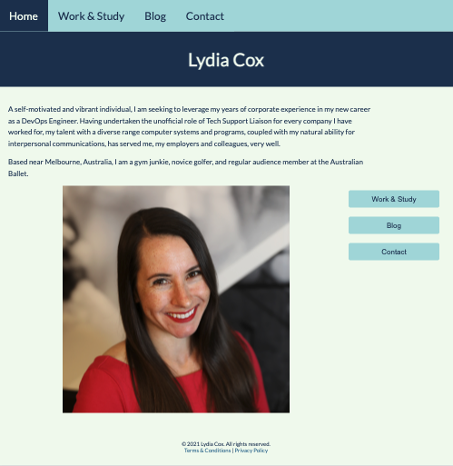

# Lydia Cox T1A2

https://lydiacox.github.io

https://github.com/lydiacox/lydiacox.github.io

## Description of website
This is a website to showcase my abilities as a Web Developer/DevOps Engineer.

### Purpose, functionality/features
I chose the Google font Lato for it accessability to dyslexic readers, downloading the font family to my files, rather than linking to Google, to prevent issues with the SRI. I also increased the line spacing to 1.6 for better readability.

I added descriptive alt texts to images, including the emotions of the photo subjects, where possible.

I wanted to select a clean colour palette, with the highlight colour to match the shade of red in my dress. As red text/background can be difficult to read, I only used this colour sparingly. It appears when hovering over a button or selection in the nav menu, as an outline around blog posts, and as a focus outline for site visitors using their keyboard to navigate the site.

### Colors used:
* Raspberry #E63946
* Light green #F1FAEE
* Aqua #A8DADC
* Mid-blue #457B9D
* Dark blue #1D3557

## Sitemap

## Screenshots
### Homepage

## Target Audience 
My target audience is potential employers looking to engage a dev or IT professional. They will already possess a high digital literacy and have high expectations of professionalism.

## Tech Stack (e.g. html, css, deployment platform, etc)
* HTML
* CSS
* Deployed on GitHub