# Lydia Cox T1A2

https://lydiacox.github.io

https://github.com/lydiacox/lydiacox.github.io

## Description of website
This is a website all about me, showcasing my abilities as a Web Developer.

## Purpose, functionality/features
Having worked in marketing for many years, I had to create a website with a UX that was functional and intutive, and a UI that was aesthetically pleasing. All of the pages are accessible from the home page, and all are in the navigation menu at the top of the screen, with the exception of the Privacy Policy and Terms & Conditions, which are found in the footer.
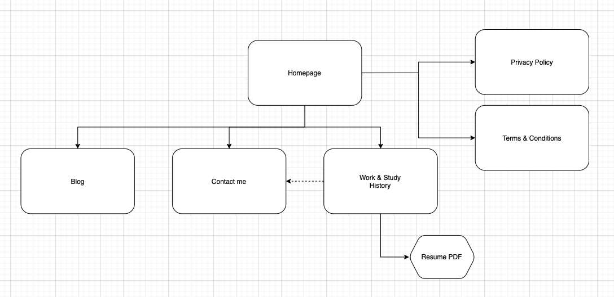

I chose the Google font Lato for it accessability to dyslexic readers, downloading the font family to my files, rather than linking to Google, to prevent issues with the SRI. I also increased the line spacing to 1.6 for better readability.

I added descriptive alt texts to images, including the expression of the photo subjects, where possible.

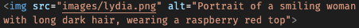
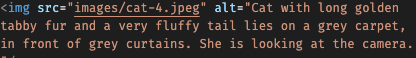

I wanted to select a clean colour palette, with an eye-catching highlight colour. I decided to try to match the shade of red in my dress.
### Colors used:

* Raspberry #E63946
* Light green #F1FAEE
* Aqua #A8DADC
* Mid-blue #457B9D
* Dark blue #1D3557

As red text/background can be difficult to read, I only used this colour sparingly. It appears:
* when hovering over a button or selection in the nav menu
* as an outline around blog posts
* as a focus outline for site visitors using their keyboard to navigate the site
* in the favicon

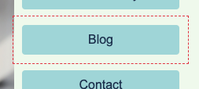

The nav menu features at the very top of the screen, and is fixed, so that users can navigate around the site no matter where they've scrolled to. The size of the menu and its fonts increases with the size of the user's screen. For very long pages, such as Terms & Conditions, I included anchors to the top of the page.

Main headings of the page are extra-large and create a block of colour.

### Home page

The home page is formatted with CSS Flexbox. The main body text appears above an image. On mobile, call to actions appear below the image, but on desktop and tablet they appear to the right of the image.
#### Mobile

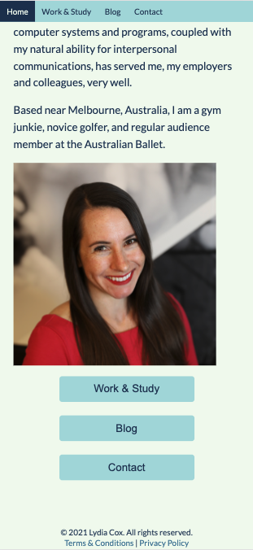
#### Tablet
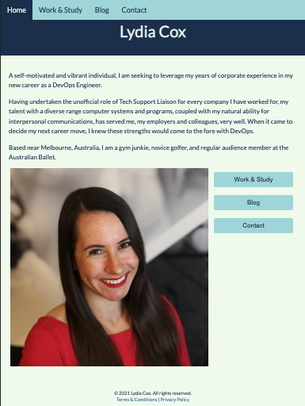
#### Desktop

### Work & Study page
This page was formatted with CSS Grid, which, if I had my time over again, I would use across the site. Call to action buttons at the bottom of the page link to my résumé in PDF format, and the Contact page.
#### Mobile
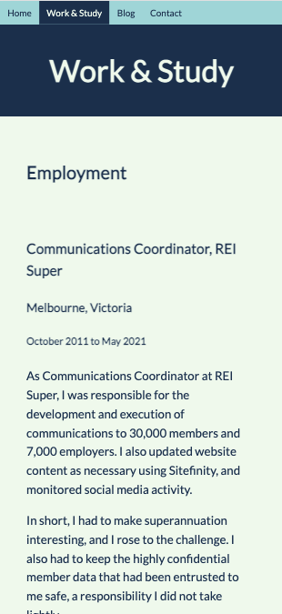
#### Tablet

#### Desktop
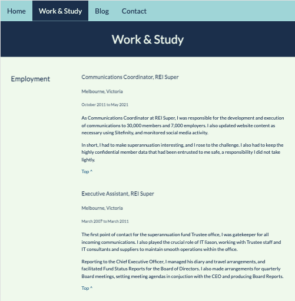
### Blog page
This page was also formatted with CSS Flexbox, with the page broken into two columns for tablet size and larger. For phone size the right "About me" column moves below the left.
#### Mobile
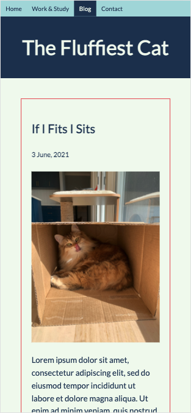
#### Tablet
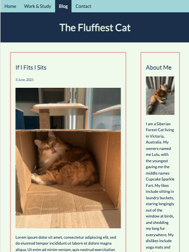
#### Desktop
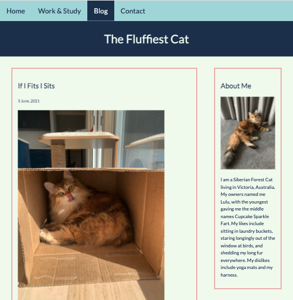
### Contact
The Contact page is very simple, with three call to action buttons. The LinkedIn and GitHub buttons open in new windows, and the Email button creates an email addressed to me.
#### Mobile
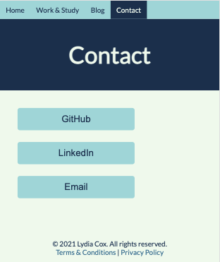
#### Tablet

#### Desktop
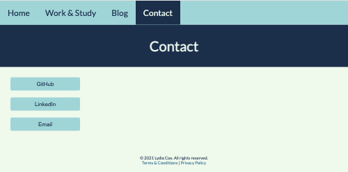
### Privacy, Terms & Conditions
These pages have very similar layouts, with large blocks of text broken up by subheadings. Anchors guide the user back to the top of the page.
#### Mobile
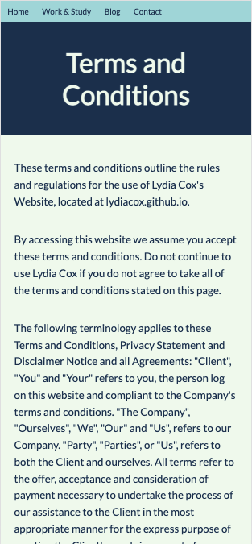
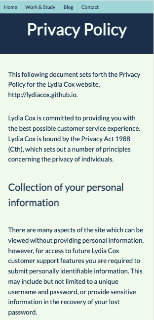
#### Tablet
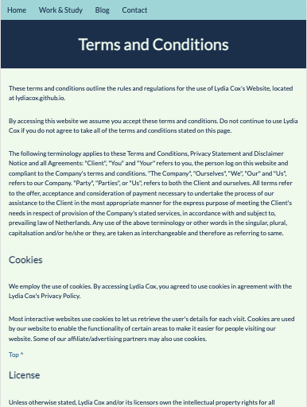
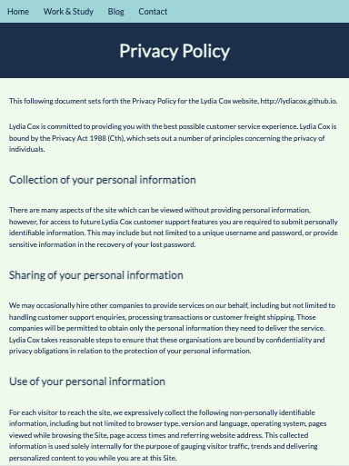
#### Desktop
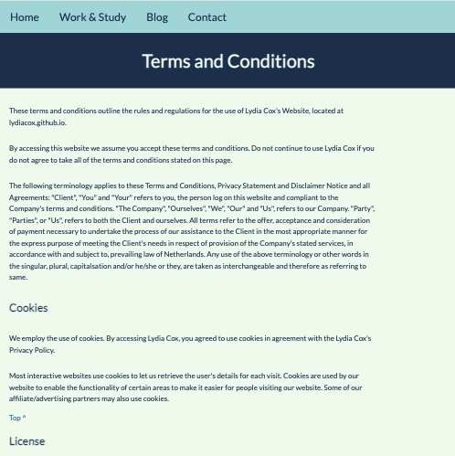
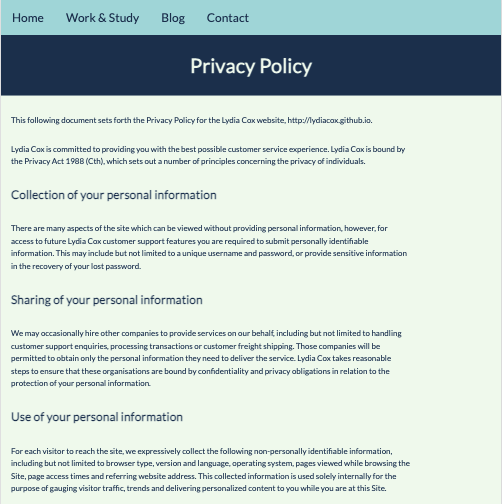

## Target Audience 
My target audience is potential employers looking to engage a dev or IT professional. They will already possess a high digital literacy and have high expectations of professionalism.

## Tech Stack (e.g. html, css, deployment platform, etc)
* HTML
* CSS
* Repository stored on GitHub
* Deployed on GitHub Pages

Being the only person working on this project, I could have named my branches anything I wanted, but to keep everything orderly, I started all branch names with a three digit number, with the exception of Main. I ended up with branches 001 through 007. Getting up to 999 branches seems impossible, although perhaps on larger projects that does happen!